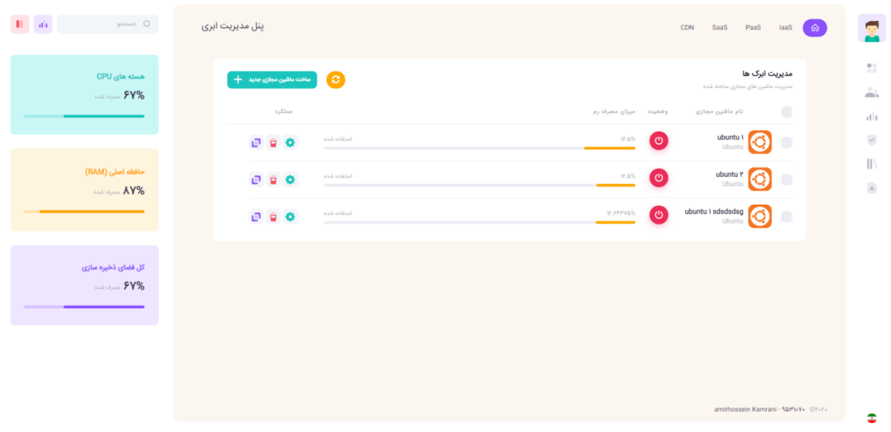
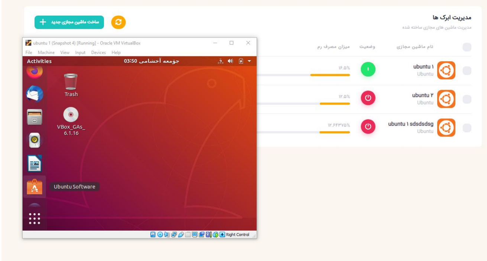
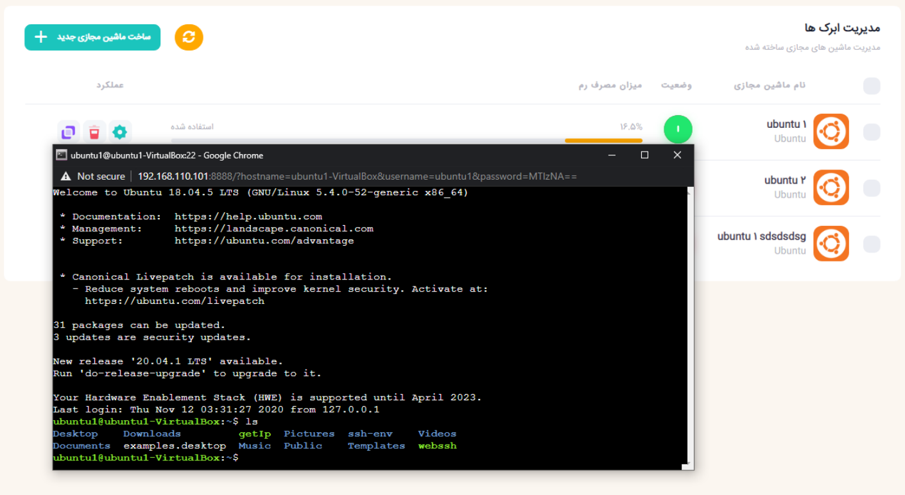

# VirtualBox Cloud Manager
Cloud manager web application based on Virtual Box SDK tools

## Introduction
It's a simple sample cloud manager app to manage virtual machines created by VirtualBox.
It's based on VirtualBox SDK tools so you need to install it first.

## Features
* Start/Stop vms.
* Change vm's name.
* Create/Remove vms.
* Change Memory(mB) and CPU(#Cores) of vms.
* Web based terminal and automatic SSH to vms.
* Monitor Memory usage and CPU usage (for each vm)
* Monitor Memory usage and CPU usage (total)

## How to use
1) Clone this repo using `git clone https://github.com/aKamrani/VirtualBox-Cloud.git`
2) Install dependencies (using `pip install -r requirements.txt`).
3) Invoke `python cloud_manager.py` to start web app & connect to VBoxManager.
4) Enjoy ❤

## Dashboard Examples
### demo:

### pictures:

## LICENSE
MIT, see LICENSE.md file.

## Contributions
**any contributions is welcome**
